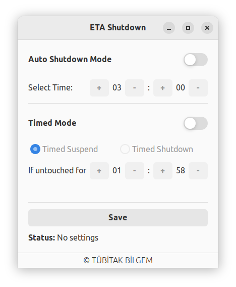
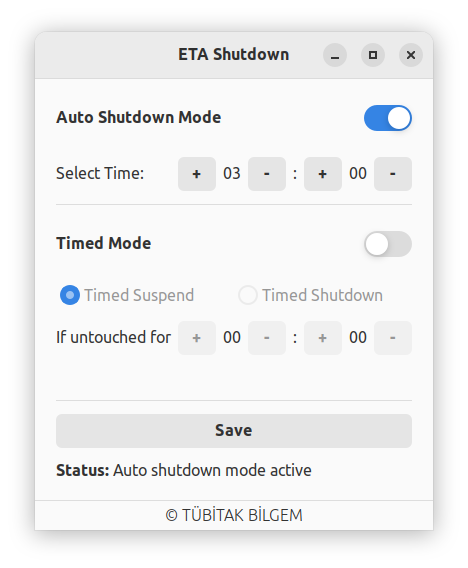
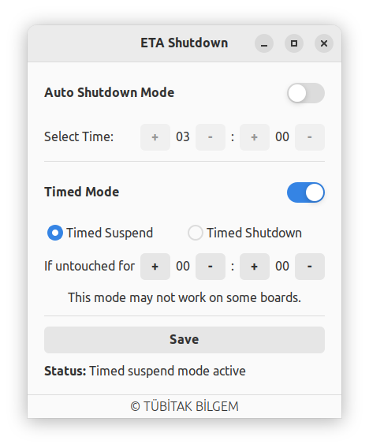
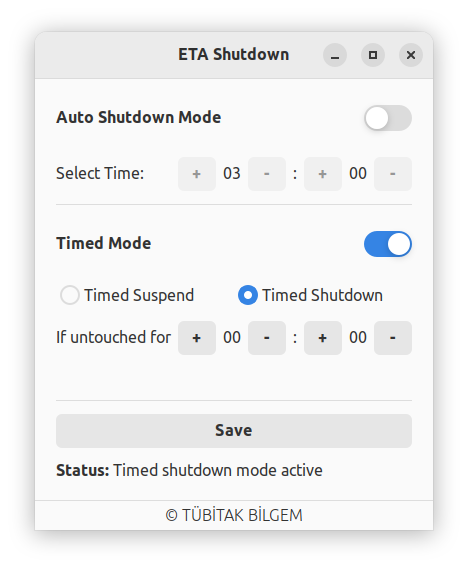

# Eta Shutdown

Python GTK application to automatically shutdown your computer

### **Dependencies**

This application is developed based on Python3 and GTK+ 3. 

Dependencies
```bash
gir1.2-glib-2.0 gir1.2-gtk-3.0
```

### **Run Application from Source**

Install dependencies
```bash
sudo apt install gir1.2-glib-2.0 gir1.2-gtk-3.0
```
Clone the repository
```bash
git clone https://github.com/pardus/eta-shutdown.git ~/eta-shutdown
```
Run application
```bash
python3 ~/eta-shutdown/src/Main.py
```

### **Build deb package**

```bash
sudo apt install devscripts git-buildpackage
sudo mk-build-deps -ir
gbp buildpackage --git-export-dir=/tmp/build/eta-shutdown -us -uc
```

### **Screenshots**









--------------------------------------
<br>